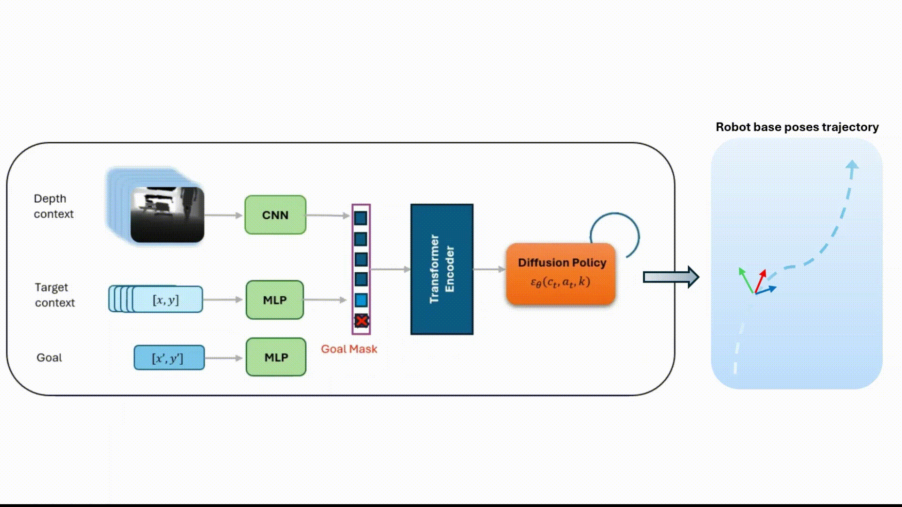

<div align="center">
<h2>Pilot Behavior Cloning</h2>
<h3>A Method For Learning Tracking Skills From Human Demos</h3>


</div>

---

- [Overview](#overview)
- [Getting Started](#getting-started)
    - [Dependencies](#dependencies)
    - [Installation](#installation)
- [Usage](#usage)
    - [Data](#data)
    - [Train](#train)
    - [Deploy](#deploy)
- [License](#license)


---


## Overview

This repository contains the code and resources related to an ongoing research of learning visual navigation policy in autonomous person-following task based on supervised Imitation Learning framework.

This framework involves collecting visual data from human demonstrations and labeling it with the odometry of
the traversed trajectory. The resulting agent uses this visual context to generate action trajectories,
employing generative models, including diffusion policies and transformers in a goal-condition fashion. The system enables a mobile
robot to track a subject and to navigate
around obstacles. This approach has the potential to simplifies and scale data collection and facilitates deployment in new environments (no need in mapping process) and robots (data is robot agnostic),
by non-experts.


**&rarr; Collect data by hand in your environment**
<p align="center">
  


**&rarr; Clone behavior using Diffusion Policy**
<p align="center">
  

**&rarr; Deploy on your robot**
<p align="center">
  


This is research code, expect that it changes often and any fitness for a particular purpose is disclaimed.


---

## Getting Started

#### Dependencies


Project was tested on:
- ubuntu >=20
- python >= 3.8
- cuda >=11.7
- built on ROS noetic
  
Deploy:
  
  - platforms: unitree go2, turtlebot3
  - edge devices: Jetson orin dev-kit, Jetson orin nano

Additionally, the whole project-cycle (data collection till deploy) depends on following software:

- [zion_ros_interface](https://github.com/nimiCurtis/zion_zed_ros_interface) (iterface wrapper for zed cameras and bag recording system)
- [bagtool](https://github.com/nimiCurtis/bagtool) (bag processing and pilot_bc dataset structure creator)
- [waypoints_follower_control](https://github.com/nimiCurtis/waypoints_follower_control) (ROS wrapper for a simple waypoints reaching controller)


#### Installation

1. Clone repo:
```sh
git clone https://github.com/nimiCurtis/pilot_bc
```

2. Install the project:
```sh
cd pilot_bc && pip install -e .
```

---
## Usage

#### Data

In this project, data collection is performed by recording ROS bag files using a robot or manually with the appropriate system.   

If you have a folder containing ROS bag files, you can process and extract them into a desired dataset structure by adjusting the relevant settings in the ```pilot_train/config/process_bag_config.yaml``` file.
Once configured, you can run the following command to convert the bags to a dataset:

```bash
python pilot_train/bag2dataset.py
```

Dataset folder should be looked as follow:

```
├── <dataset folder name>
│   ├── <name_of_bag_batch1>
|   |    ├── raw_data
│   │       ├── raw_<topic1>.h5
│   │       ├── ...
│   │       └── raw_<topicN>.h5
|   |    ├── visual_data
|   |       ├── depth            
│   │           ├── 0.jpg
│   │           ├── ...
│   │           └── T.jpg
|   |       └── rgb          
│   │           ├── ...
│   │           └── T.jpg
│   │    ├── metadata.json
│   │    ├── robot_traj_data.json
│   │    ├── target_traj_data.json (when using the object detection topic)
│   │    └── traj_sample.mp4
│   ...
└── └── <name_of_bag_batchN>
         ├── raw_data
            ├── raw_<topic1>.h5
            ├── ...
            └── raw_<topicN>.h5
         ├── visual_data
             ├── depth            
                 ├── 0.jpg
                 ├── ...
                 └── T.jpg
             └── rgb          
                 ├── ...
                 └── T.jpg
         ├── metadata.json
         ├── robot_traj_data.json
         ├── target_traj_data.json (when using the object detection topic)
         └── traj_sample.mp4
```  

Once the dataset is prepared,split and calculate stats by:

```bash
python pilot_train/data/data_split_and_stats.py -r <dataset folder name> -i <dataset folder path>
```

The stats will be saved in the relevant files located in the `pilot_config` directory, which will be used during the training phase.

#### Train

First, configure the main training configuration file at `pilot_config/train_pilot_policy.yaml` to match your training requirements (e.g., models, hyperparameters, etc.).

**Note:** Ensure a few absolute paths are updated accordingly.

Configuration files in this project are managed using the hydra lib, so it's recommended to familiarize yourself with hydra for efficient configuration management.


Once config is prepared, train a pilot agent with:

```bash
pyothon pilot_train/train.py
```

**Note:** All configs, logs, and model weights are saved in a folder within ```pilot_train/logs```, with the folder name generated from the configuration file as follows:

```yaml
... (some params)
log:
  ...
  run_name: train_pilot_policy/${policy_model.name}/${log.desc}${now:%Y-%m-%d}_${now:%H-%M-%S}
  ...

```


#### Deploy

The deployment stage is organized under the `pilot_deploy` directory. 

First, create a `checkpoints` folder and a subfolder for your pilot agent:

```bash
cd pilot_deploy && mkdir checkpoints
cd checkpoints && mkdir <agent name>
```

Once you have a trained agent, copy (from the logs dir) its `config.yaml` file and model weights to `pilot_deploy/checkpoints/<agent name>`.


Now, all that remains is to deploy the agent by using the [waypoints_follower_control](https://github.com/nimiCurtis/waypoints_follower_control) ROS package and enjoy some rollouts.

Static experiments:
<p align="center">
<div style="display: flex; justify-content: center;">
  
  
  
</div>
</p>

Dynamic experiments:

<p align="center">
<div style="display: flex; justify-content: center;">
  
  
  
</div>
</p>

---


## License

This repository is licensed under the Apache [License](/LICENSE). Feel free to use, modify, and distribute the code as per the terms of this license.


---

[↑ Return](#Top)

